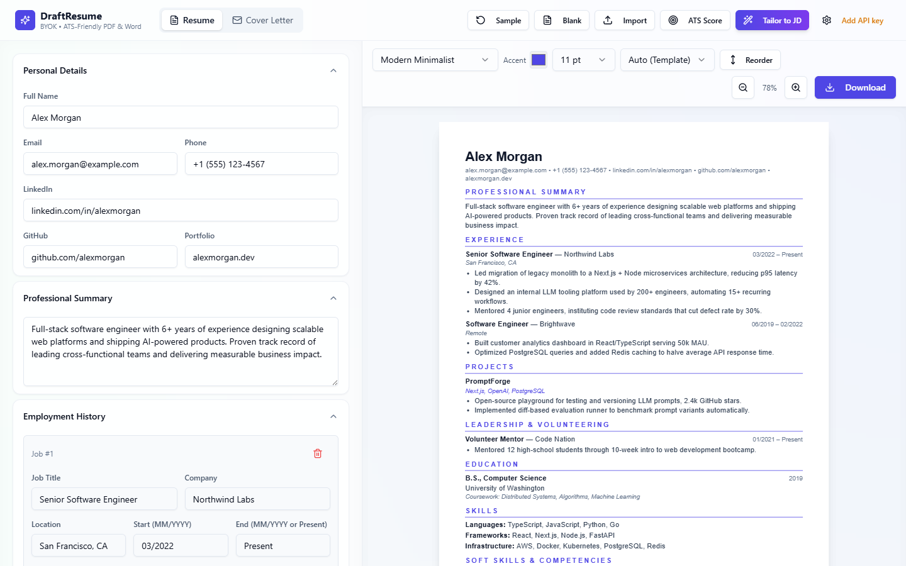
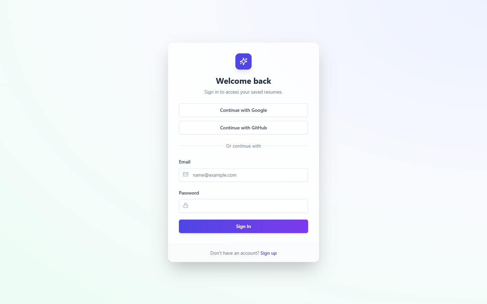
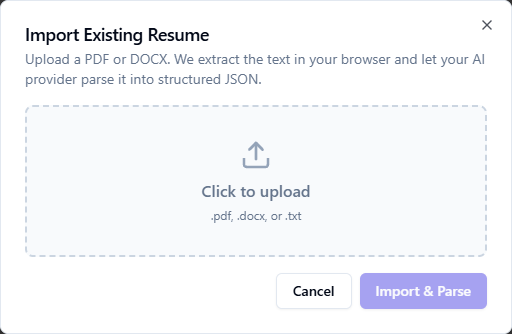
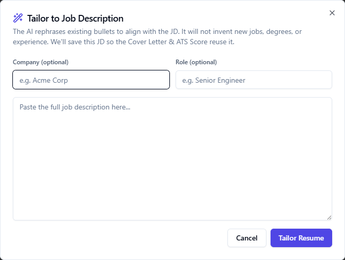
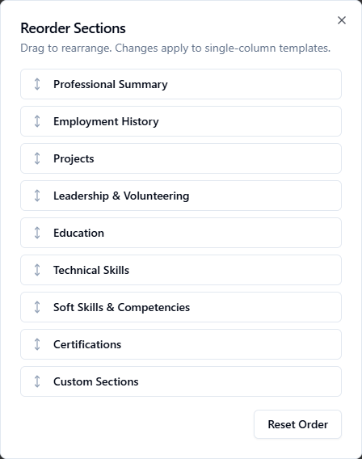
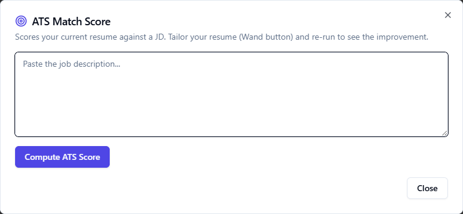

# DraftResume

DraftResume is an AI-powered, BYOK (Bring Your Own Key) resume builder designed to help users quickly extract, tailor, and export ATS-friendly resumes and cover letters. 




## ✨ Core Features

### 📥 Import Existing Resume
Upload a PDF or DOCX file, or paste your raw unformatted text. We extract the text in your browser and let your AI provider parse it directly into a structured, editable JSON format. No need to start from scratch!


### 🎯 Tailor to Job Description
The AI rephrases your existing bullet points and professional summary to align perfectly with the provided Job Description. **It will not invent new jobs, degrees, or experience.** It only highlights the existing truths that matter to the employer. We'll save this JD so the Cover Letter and ATS Score tools can reuse it seamlessly.


### ↕️ Reorder Sections
Drag to rearrange your resume sections (e.g., move Education above Employment). Changes apply instantly to single-column templates, allowing you to prioritize the most relevant information for your career stage.


### 📊 ATS Score Checker
Instantly evaluate how well your resume matches the target Job Description. Ensure you hit the right keywords to pass Applicant Tracking Systems before you apply.


### 🎨 Multiple Formats & Customization
- **Multiple Formats**: Switch between multiple beautifully designed CV templates or generate a matching Cover Letter.
- **Custom Sections**: Add custom sections to highlight unique achievements, publications, languages, or awards.
- **Visual Options**: Customize your resume with color options and distinct typography settings.

### 🖨️ What You See Is What You Print (WYSIWYG)
- **Multiple Download Options**: Export perfectly formatted resumes in standard PDF or native Word Document (.docx) formats.
- **Flawless Formatting**: The live preview precisely matches the final exported document, ensuring no layout surprises when you hit download.

---

## 🛠️ Tech Stack

- **Framework**: [Next.js 14](https://nextjs.org/) (App Router)
- **UI & Styling**: [React 18](https://react.dev/), [Tailwind CSS](https://tailwindcss.com/), [Radix UI](https://www.radix-ui.com/)
- **State Management**: [Zustand](https://github.com/pmndrs/zustand)
- **Authentication & Database**: [Supabase](https://supabase.com/)
- **Document Export**: `jspdf` (PDF), `docx` (Word)
- **Drag & Drop**: `@dnd-kit/core`

## 🔐 Authentication & Cloud Storage

DraftResume uses **Supabase** for user authentication and data persistence.

- **Authentication**: Users can sign up and log in securely. The app uses `@supabase/ssr` to manage secure sessions via cookies, protecting routes via Next.js Middleware.
- **Cloud Sync**: Securely save your structured resume directly to your Supabase account, making it accessible across devices.

## 🤖 BYOK AI Architecture

The core AI engine operates securely through a Next.js serverless route (`/api/ai`), interacting directly with the AI provider using the user's provided API key (OpenAI/Anthropic). 

Your API key is stored locally in your browser. The server acts as a secure proxy, enforcing strict JSON schemas to ensure the AI always returns predictably structured data without hallucination.

## 💻 Running Locally

1. Clone the repository:
   ```bash
   git clone https://github.com/vishalvermauts/DraftResume.git
   cd DraftResume
   ```
2. Install dependencies:
   ```bash
   npm install
   ```
3. Configure Environment Variables (`.env.local`):
   ```env
   NEXT_PUBLIC_SUPABASE_URL=your-supabase-url
   NEXT_PUBLIC_SUPABASE_ANON_KEY=your-supabase-anon-key
   ```
4. Start the development server:
   ```bash
   npm run dev
   ```
5. Open [http://localhost:3001](http://localhost:3001) in your browser.
